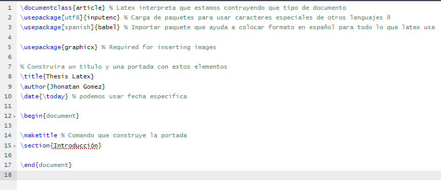

# Tipos de comandos

## ¿Qué se entiende por lenguaje de alto nivel en latex?

Los comandos deben seguir una sintaxis precisa


## ¿Cuantos tipos de comandos existen en latex? ¿Cuáles son?

4 tipos principales

1. \comando 

2. \comando{ atributos }

3. \comando[ opciones ]

4. \comando[ opciones ]{ atributos }

## ¿Cuáles son las dos partes fundamentales de un documento latex?

- Preambulo 

```latex
\documentclass{}
% Preambulo
```


- Cuerpo del documento

```latex
\begin{document}
% cuepo del documento
\end{document}

```




