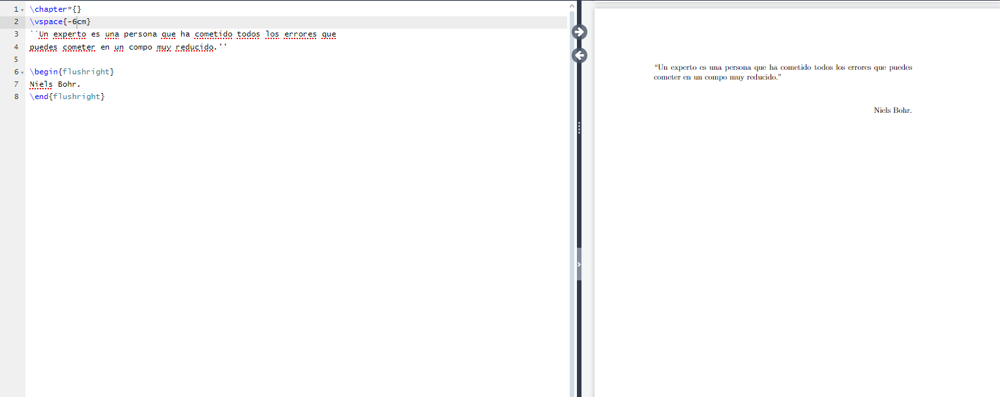

# Editando la dedicatoria

## ¿Como luce una dedicatoria?

En texto haciendo referencia a un pensamiento que puede ser de algun autor.

Si es una referencia a algo que dijo una persona puede ir entre comillas <<>> o "" "" con el nombre del autor a la derecha.

El texto debe de ir arriba de la hoja.



## ¿Como podemos colocar comillas dobles en latex?

```latex
`` Pensamiento ''
```

## ¿Como podemos subir un texto? incluso ocupado el espacio que una seccion "chapter" dejaria

utilizando el comando `\vspace{-4cm}` con un número negativo

