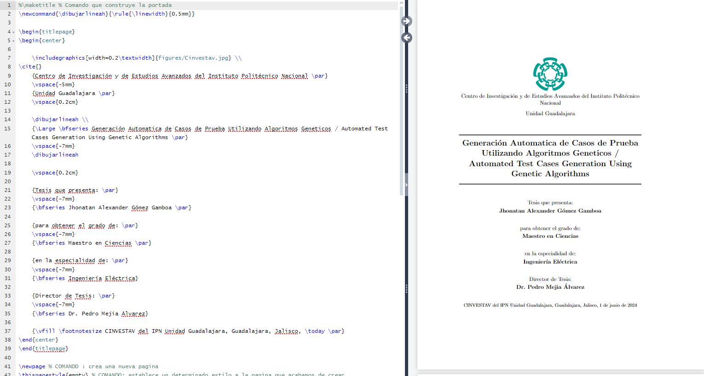

# Contruyendo una portada

## ¿Como podemos crear y colocar una portada personalizada?

Debemos de omitir la portada por defecto del comando `\maketitle`

Crear el entorno siguiente:

```latex
\begin{titlepage}

\begin{center}

    {Parrafo 1 \par}
    {Parrafo 2 \par}
    {Parrafo 3 \par}
    %    ...

\end{center}

\end{titlepage}
```

Podemos utilizar dentro de los bloques {} cualquiera de los comandos aprendidos para modificar tamaños, posiciones, perfiles, grosores, separaciones, etc..



## ¿Qué comando nos permite agregar o quitar distancia de forma vertical?

`\vspace{}`

Puede acceptar distancias negativas para subir un texto

## ¿Que comando nos permite colocar un parrafo en la ultima linea de la pagina?

`\vfill`

Este comando puede ir al entre parrafos

```latex
{parrafo 1 \par}
\vfill
{parrafo pie de pagina \par}
```

## ¿Como podemos crear nuevos comandos? (Linea horizontal)

utilizando el comando `\newcommand{}{}`

por ejemplo:

```latex
\newcommand{\dibujarlineah}{\rule{\linewidth}{0.5mm}}
```

## ¿Como podemos agregar imagenes?

1. Debemos de importar la libreari "graphicx" `\usepackage{graphics}`

2. Utilizar el comando `\includegraphics[]{}`

Donde la opción podemos poner su tamaño, y el argumento es su ubicación


