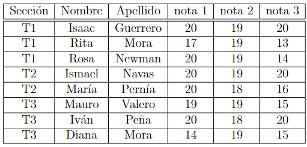
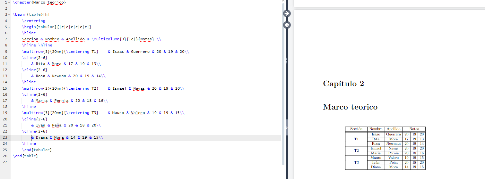

# tablas parte 2

## ¿Como se puede combinar columnas con información repetida?

Partiendo de la siguiente tabla:

```latex
\begin{table}[h]
    \centering
    \begin{tabular}{|c|c|c|c|c|c|}
    \hline
    Sección & Nombre & Apellido & nota 1 & nota 2 & nota 3\\
    \hline \hline
    T1 & Isaac & Guerrero & 20 & 19 & 20\\
    \hline
    T1 & Rita & Mora & 17 & 19 & 13\\
    \hline
    T1 & Rosa & Newman & 20 & 19 & 14\\
    \hline
    T2 & Ismael & Navas & 20 & 19 & 20\\
    \hline
    T2 & María & Pernía & 20 & 18 & 16\\
    \hline
    T3 & Mauro & Valero & 19 & 19 & 15\\
    \hline
    T3 & Iván & Peña & 20 & 18 & 20\\
    \hline
    T3 & Diana & Mora & 14 & 19 & 15\\
    \hline
    \end{tabular}
\end{table}
```

Que nos da la siguente salida:



debemos de utilizar el comando `\multicolumn{}{}{}`

1er atributo debe ser el número de columnas a combinar

2do atributo debe colocarse la alineación

3er El contenido que queremos escribir

```latex
\begin{table}[h]
    \centering
    \begin{tabular}{|c|c|c|c|c|c|}
    \hline
    Sección & Nombre & Apellido & \multicolumn{3}{|c|}{Notas} \\
    \hline \hline
    T1 & Isaac & Guerrero & 20 & 19 & 20\\
    \hline
    T1 & Rita & Mora & 17 & 19 & 13\\
    \hline
    T1 & Rosa & Newman & 20 & 19 & 14\\
    \hline
    T2 & Ismael & Navas & 20 & 19 & 20\\
    \hline
    T2 & María & Pernía & 20 & 18 & 16\\
    \hline
    T3 & Mauro & Valero & 19 & 19 & 15\\
    \hline
    T3 & Iván & Peña & 20 & 18 & 20\\
    \hline
    T3 & Diana & Mora & 14 & 19 & 15\\
    \hline
    \end{tabular}
\end{table}
```

## ¿Como se puede combinar columnas con información repetida?

partiendo del código:

```latex
\begin{table}[h]
    \centering
    \begin{tabular}{|c|c|c|c|c|c|}
    \hline
    Sección & Nombre & Apellido & \multicolumn{3}{|c|}{Notas} \\
    \hline \hline
    T1 & Isaac & Guerrero & 20 & 19 & 20\\
    \hline
    T1 & Rita & Mora & 17 & 19 & 13\\
    \hline
    T1 & Rosa & Newman & 20 & 19 & 14\\
    \hline
    T2 & Ismael & Navas & 20 & 19 & 20\\
    \hline
    T2 & María & Pernía & 20 & 18 & 16\\
    \hline
    T3 & Mauro & Valero & 19 & 19 & 15\\
    \hline
    T3 & Iván & Peña & 20 & 18 & 20\\
    \hline
    T3 & Diana & Mora & 14 & 19 & 15\\
    \hline
    \end{tabular}
\end{table}
``` 

Utilizando el comando `\multirow{}{}{}` los argumentos.

1. Debe de contener el número de filas a combinar

2. El tamaño horizontal de la columna

3. Nombre que queremos que aparezca

Tambien debemos de proveer otro comando para dibujar las lineas en lugar de usar `\hline` debemos usar `\cline{}` para columnas

`\cline{2-6}` como atributo debemos de colocar de que columnas queremos que mantengan sus linea horizontales que separan cada fila, en este ejemplo estamos diciendo que la columna 1 no debe de tener lineas horizontales para separar sus filas.

```latex
\begin{table}[h]
    \centering
    \begin{tabular}{|c|c|c|c|c|c|}
    \hline
    Sección & Nombre & Apellido & \multicolumn{3}{|c|}{Notas} \\
    \hline \hline
    \multirow{3}{20mm}{\centering T1}    & Isaac & Guerrero & 20 & 19 & 20\\
    \cline{2-6}
        & Rita & Mora & 17 & 19 & 13\\
    \cline{2-6}
        & Rosa & Newman & 20 & 19 & 14\\
    \hline
    \multirow{2}{20mm}{\centering T2}    & Ismael & Navas & 20 & 19 & 20\\
    \cline{2-6}
        & María & Pernía & 20 & 18 & 16\\
    \hline
    \multirow{3}{20mm}{\centering T3}    & Mauro & Valero & 19 & 19 & 15\\
    \cline{2-6}
        & Iván & Peña & 20 & 18 & 20\\
    \cline{2-6}
        & Diana & Mora & 14 & 19 & 15\\
    \hline
    \end{tabular}
\end{table}
```



