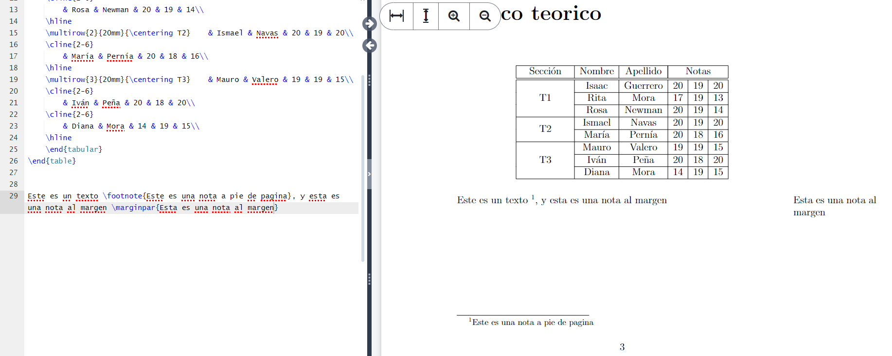

# Notas a pie de pagina y margenes

## ¿Que comando nos permite colocar notas?

- Nota a pie de pagina `\footnote{Es una nota a pie de pagina}`

- Nota al margen `\marginpar{Es una nota al margen}`

